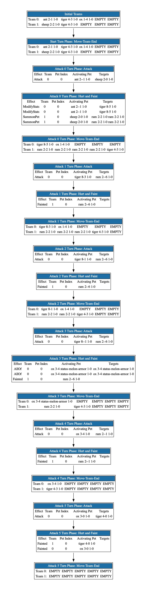

=====
sapai
=====

|  |license|  |test-status|  |coverage| 

``sapai`` is a Super Auto Pets engine built with reinforcement learning training and other related AI models in mind. You may see more of my published work in machine learning on `ResearchGate <https://www.researchgate.net/publication/347653898_Machine_Learned_Model_for_Solid_Form_Volume_Estimation_Based_on_Packing-Accessible_Surface_and_Molecular_Topological_Fragments>`_ or `ACS <https://pubs.acs.org/doi/full/10.1021/acs.jpca.0c06791>`_.

You may see and use ``sapai`` examples easily through `Google Colab <https://colab.research.google.com/drive/1sMF50gDxpZt9c98inn4ldMvfgEcfWQa9>`_

.. figure:: doc/static/workflow.png
    :height: 380
    :width: 404
    :align: center
    
    
.. contents::
    :local:
    
------------
Installation
------------

To start installing and using ``sapai``, it's highly recommended to start from an Anaconda distribution of Python, which can be downloaded for free here_. 

.. _here: https://www.anaconda.com/products/individual

Then download the library from Github. A ``zip`` file can be downloaded using the green download code button. Alternatively, this repository can be obtained using the following command from the command-line. 

.. code-block:: bash
    
    git clone https://github.com/manny405/sapai.git

After navigating to the ``sapai`` directory, installation is completed with the following command. 

.. code-block:: bash

    python setup.py install

Unit tests are located in the ``tests`` directory. Tests can be run with the following command

.. code-block:: bash

    python -m unittest discover -s tests

    
---------------------------
Introduction: Code Examples
---------------------------

The following code exampes will be run through the Python shell. To start a Python shell session, open up your preferred command-line program, such as Terminal or Powershell, then type and enter ``python``.

###############
Creating a Pet
###############

.. code-block:: python
    
    >>> from sapai.pets import Pet
    >>> pet = Pet("ant")
    >>> print(pet)
    ### Printing pet is given in the form of < PetName Attack-Health Status Level-Exp > 
    < pet-ant 2-1 none 1-0 >
    >>> pet._attack += 3
    >>> pet.gain_experience()
    >>> print(pet)
    < pet-ant 5-1 none 1-1 >
    >>> print(pet.ability)
    ### Organization of pet abilities provided by super-auto-pets-db project
    {'description': 'Faint: Give a random friend +2/+1',
     'trigger': 'Faint',
     'triggeredBy': {'kind': 'Self'},
     'effect': {'kind': 'ModifyStats',
      'attackAmount': 2,
      'healthAmount': 1,
      'target': {'kind': 'RandomFriend', 'n': 1},
      'untilEndOfBattle': False}}
      
      
###############
Creating a Team
###############

.. code-block:: python
    
    >>> from sapai.pets import Pet
    >>> from sapai.teams import Team
    >>> team0 = Team(["ant","ox","tiger"])
    >>> team1 = Team(["sheep","tiger"])
    >>> print(team0)
    0: < Slot pet-ant 2-1 none 1-0 > 
      1: < Slot pet-ox 1-4 none 1-0 > 
      2: < Slot pet-tiger 4-3 none 1-0 > 
      3: < Slot EMPTY > 
      4: < Slot EMPTY > 
   >>> print(team1)
   0: < Slot pet-sheep 2-2 none 1-0 > 
      1: < Slot pet-tiger 4-3 none 1-0 > 
      2: < Slot EMPTY > 
      3: < Slot EMPTY > 
      4: < Slot EMPTY > 
   >>> team0.move(1,4)
   >>> print(team0)
   0: < Slot pet-ant 2-1 none 1-0 > 
      1: < Slot EMPTY > 
      2: < Slot pet-tiger 4-3 none 1-0 > 
      3: < Slot EMPTY > 
      4: < Slot pet-ox 1-4 none 1-0 >  
   >>> team0.move_forward()
   >>> print(team0)
   0: < Slot pet-ant 2-1 none 1-0 > 
      1: < Slot pet-tiger 4-3 none 1-0 > 
      2: < Slot pet-ox 1-4 none 1-0 > 
      3: < Slot EMPTY > 
      4: < Slot EMPTY > 
    
#######
Battles
#######

.. code-block:: python
    
    ### Using the teams created in the last section
    >>> from sapai.battle import Battle
    >>> battle = Battle(team0,team1)
    >>> winner = battle.battle()
    >>> print(winner)
    2
    ### Possible fight outputs:
    ### 0 = Team0 Wins
    ### 1 = Team1 Wins
    ### 2 = Draw

The implementation of battle is efficient. Using IPython magic, this can be tested using the following IPython method:

.. code-block:: python

      from sapai.pets import Pet
      from sapai.teams import Team
      from sapai.battle import Battle
      team0 = Team(["ant","ox","tiger"])
      team1 = Team(["sheep","tiger"])
      
      def timing_test():
          b = Battle(team0,team1)
          winner = b.battle()
      
      %timeit timing_test()      
      ### On 2019 Macbook Pro:
      ###   8.12 ms ± 450 µs per loop (mean ± std. dev. of 7 runs, 100 loops each)
      ###   More than 100 battle per second on a single core

      ### On Xeon Platinum 8124M @ 3.00GHz
      ###  6.06 ms ± 49.1 µs per loop (mean ± std. dev. of 7 runs, 100 loops each)
      ###  More than 150 battle per second on a single core
      
      ### On 2021 MPB with M1 Pro Processor:
      ###  4.32 ms ± 20.8 µs per loop (mean ± std. dev. of 7 runs, 100 loops each)
      ###  More than 230 battle per second on a single core
      
^^^^^^^^^^^^
Battle Graph
^^^^^^^^^^^^

All battle history is stored for every phase, effect, and attack that occured during the battle. This battle history can be graphed and visualized. The full graph for the battle is shown below. 

  >>> from sapai.graph import graph_battle
  >>> graph_battle(battle, file_name="Example")

    :height: 2140
    :width: 536
    :align: center

------
Status
------

Ongoing

1. See the issues page for ongoing discussions. The code-base is completely ready for the development of AI engines around SAP. 

.. |license| image:: https://img.shields.io/badge/License-MIT-yellow.svg
.. |test-status| image:: https://github.com/manny405/sapai/actions/workflows/run_tests.yml/badge.svg
.. |coverage| image:: https://codecov.io/gh/manny405/sapai/branch/main/graph/badge.svg?token=5RDE13SYET
